# Sheet-Cell – README

**SheetCell** is an advanced spreadsheet engine designed for performing
calculations, organizing, and managing data dynamically. The system
simulates the functionality of a spreadsheet like Excel or Google
Sheets, enabling users to perform advanced calculations, share, and
update data in real-time. The system also offers unique features like
version management, recalculating values, supporting custom functions,
and more.

# 

Table of Contents

[General Description ](#general-description)

[Helper Functions ](#_Toc182062380)

[Running the Project ](#running-the-project)

[System guide ](#system-guide)

##  General Description

The system is divided into four main modules, each responsible for a
different part of the application:

1.  **Engine Module:**

    - This module contains all the system’s logic, including value
      calculations, cell management, version control, and
      synchronization between different cells. The engine performs
      requested calculations, manages recalculations, and provides the
      necessary data to the UI module.

2.  **UI Module:**

    - The UI module is responsible for displaying the data to the user
      through a graphical interface built with JavaFX. The interface
      allows the user to input data, execute functions, view results,
      and interact with the system in a user-friendly manner.

3.  **DTO Module (Data Transfer Objects):**

    - This module acts as a bridge for transferring data between the
      engine and the UI. It is responsible for organizing and
      structuring the data in a way that is easy to transmit between the
      different modules of the system.

4.  **Server Module:**

    - The server module is responsible for handling client requests and
      "activating" the engine. It supports remote services, enabling
      multiple users to work simultaneously on the same spreadsheet
      while maintaining synchronization and executing calculations on
      the engine.

**<u>System Implementation</u>**

1\. **Engine Module:**

- In this module, all the system's core logic is implemented. This
  includes managing the spreadsheet’s cells and recalculating values
  when a cell is modified. The engine interacts with different functions
  that perform calculations, including support for custom functions that
  allow users to execute advanced calculations.

- The spreadsheet is managed as a collection of cells, where each cell
  contains a value, data type, and calculated value. The engine
  automatically recalculates related cells when necessary.

2\. **UI Module:**

- The UI module is responsible for presenting data to the user through
  an interactive JavaFX-based graphical interface. The interface
  displays the spreadsheet clearly and provides tools for user
  interaction, such as dragging cells, updating values, and executing
  calculation functions. The interface is designed to present data in an
  intuitive way and provides users with all the necessary tools for
  efficient operation.

- Additionally, the UI module receives data from the engine module and
  updates the display accordingly.

3\. **DTO Module:**

- The DTO module serves as a data transfer layer between the engine and
  the UI. It is responsible for organizing the data in a way that is
  easily transferred and understood between the system modules. Any data
  that is passed from the engine to the UI or vice versa goes through
  the DTO module.

4**. Server Module:**

- The server module handles incoming requests from the UI or external
  systems and forwards them to the engine. The server is responsible for
  managing connections, updating data, and performing remote
  calculations. The module supports multi-user collaboration, so any
  changes made to the spreadsheet are automatically updated across all
  connected users.

**<u>Key Features</u>**

- Value Modification: Any change to a cell automatically updates its
  effective value and all related cells.

- Recalculation: Any change in a cell can affect other cells, and the
  system automatically recalculates the affected cells.

- Version Management: The system saves versions of the spreadsheet and
  allows the user to revert to previous versions.

- Functions: The system supports basic functions like addition,
  subtraction, division, and more, and allows users to define custom
  functions.

- Error Handling: The system detects errors such as circular references,
  illegal references, or references to non-existing cells.

- Additional Capabilities:

  - Cell design and styling.

  - Data filtering and sorting.

  - "WHAT-IF" analysis – dynamic value changes with immediate results.

  - Sharing spreadsheets with multiple users and collaborative editing.

## Helper Functions

The system supports defining helper functions that can be integrated
into different cells. Each function is defined with a unique name and
arguments, where each argument can be a number, string, Boolean value,
or a reference to another function.

Function Invocation Format

The function invocation will be defined using the following structure:

**{\<function name\>,\<arg 1\>,\<arg 2\>,…,\<arg n\>}**

**Explanation of the structure:**

1.  Each function is enclosed in curly braces {}.

2.  function name: The unique name of the function, in uppercase only.

3.  Each argument is separated by a comma (,), and there are no spaces
    between the commas.

4.  arg i: The i-th argument that the function receives. This can be a
    number, string, Boolean value, or a reference to another function.

5.  Invalid result: If the function cannot return a valid result, it
    will return the following:

    - NaN for numeric values.

    - !UNDEFINED! for string values.

    - UNKNOWN for Boolean values.

6.  If the function is not valid in terms of its structure (unknown
    name, incorrect number of arguments), it will invalidate its value
    and halt the computation.

7.  Any operation on a cell with an invalid value will also be
    considered invalid.

**Examples:**

- {PLUS, 4, 5} – Adds 4 and 5.

- {MINUS, {PLUS,4,5},{POW,2,3}} – Adds 4 and 5, then subtracts the
  result of 2 raised to the power of 3.

**<u>List of Helper Functions:</u>**

**Logical Functions:**

| **\#** | **Function Name** | **Description**                                  |
|:------:|-------------------|--------------------------------------------------|
|   1    | EQUAL             | Compares two values                              |
|   2    | NOT               | Boolean negation of a value                      |
|   3    | OR                | Logical OR operation between two Boolean values  |
|   4    | AND               | Logical AND operation between two Boolean values |
|   5    | BIGGER            | Checks if arg1 is greater than or equal to arg2  |
|   6    | LESS              | Checks if arg1 is smaller than or equal to arg2  |
|   7    | IF                | If-then-else Boolean function                    |

**Mathematical Functions:**

| **\#** | **Function Name** | **Description** |
|----|----|----|
| 1 | PLUS | Adds two values |
| 2 | MINUS | Subtracts two values |
| 3 | TIMES | Multiplies two values |
| 4 | DIVIDE | Divides two values (with handling for division by zero) |
| 5 | MOD | Modulo operation between two values |
| 6 | POW | Raises a value to a power |
| 7 | ABS | Returns the absolute value of a value |
| 8 | SUM | Sums values in a range |
| 9 | AVERAGE | Averages values in a range |
| 10 | PERCENT | Calculates a percentage of a value |

**String Functions:**

| \#  | Function Name | Description                        |
|-----|---------------|------------------------------------|
| 1   | CONCAT        | Concatenates two strings           |
| 2   | SUB           | Extracts a substring from a string |

**System Functions:**

| **\#** | **Function Name** | **Description**                      |
|--------|-------------------|--------------------------------------|
| 1      | REF               | References the value of another cell |

## Running the Project

**Running the Server and Client**

**1. Running the Server:**

To run the server, navigate to the Run directory in the project and
execute the server_run.bat file.

**2. Running the Client:**

To run the client, go to the Run directory, extract the client_run.zip
folder, and execute the client_run.bat file inside it. **<u>  
</u>**

## System guide

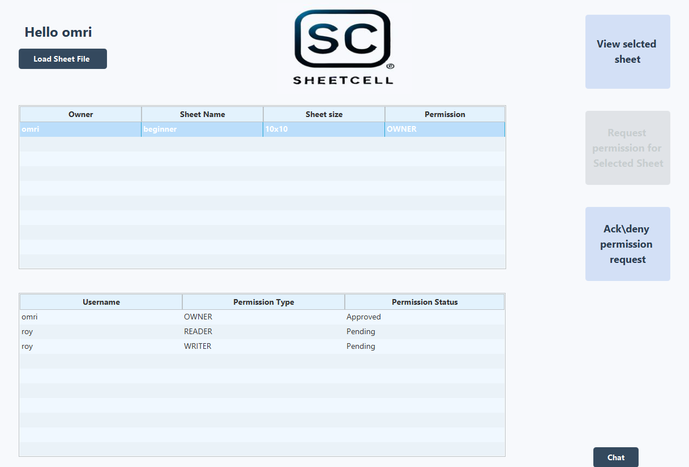

1\. Load the FXML file into the system.

2\. Display the selected sheet.

3\. Request permission for the selected sheet.

4\. Display requests for sheets owned by the user.

5\. Display all sheets in the system.

6\. Display all requests for the selected sheet along with their status.

7\. Display the system chat.

**"Action line area":**

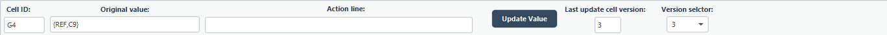

1\. **Cell ID**: Displays the ID of the selected cell.

2\. **Original Value**: Shows the original value of the selected cell.

3\. **Action Line**: Allows the user to input the value they want to
update in the selected cell.

4\. **Update Value**: Updates the selected cell with the value entered
by the user.

5\. **Last Updated Cell Version**: Displays the last updated version of
the selected cell.

6\. **Version Selector**: Enables the user to view all versions of the
sheet.

When the user selects a cell, the frame of the selected cell is
highlighted in red. The cells it depends on are highlighted in blue,
while the cells that depend on it are highlighted in green.

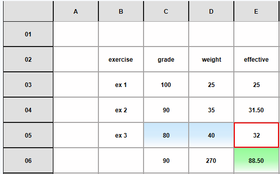

If the user clicks on a column header, all the cells in that column will
be highlighted in light red, allowing the user to apply design changes
to the entire column simultaneously.

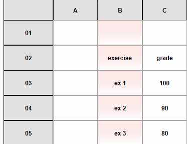

**"Style Sheet area":**

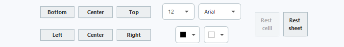

With these buttons, the user can style the selected cell or column:

- **Bottom, Center, Top, Left, Center, Right:** These buttons align the
  text according to their respective positions.

1.  In this box, the user can set the text size.

2.  In this box, the user can select the font for the text.

3.  This color picker allows the user to choose the text color.

4.  This color picker allows the user to choose the cell background
    color.

The **Reset Cell** button resets the selected cell to the default
design, while the **Reset Sheet** button applies the default design to
all cells in the sheet.

If the user clicks and drags the edges of the column headers or row
headers, they can adjust the width or height of the respective column or
row.

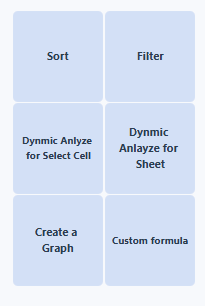**"Command
area":**

**Sort and Filter:**

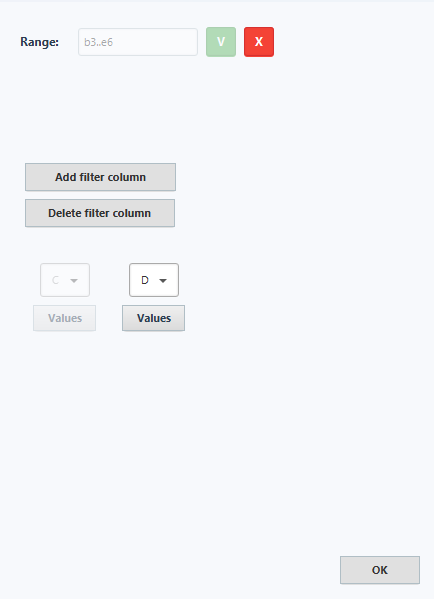

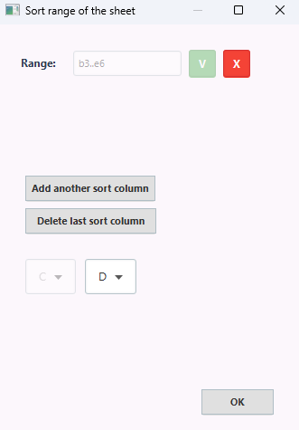**  
**

At the top of the window, the user needs to enter the range in the
following format: \<top left cell id\>..\<bottom right cell id\>. After
this, the user selects the first column, and then additional columns can
be added for sorting or filtering based on them.

**Create a Graph:**

At the top of the window, the user selects the type of graph. Then, the
user specifies the range for the x-axis and the y-axis. They can also
assign titles to each axis if desired.

1.  In this choice box, the user can choose to either enter a custom
    range or select a predefined range from the system.

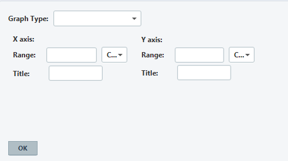

**Custom Formula:**

The user can select the desired function from the list. If the user
prefers to input a custom value, they can select "Custom" from the
Choice Box.

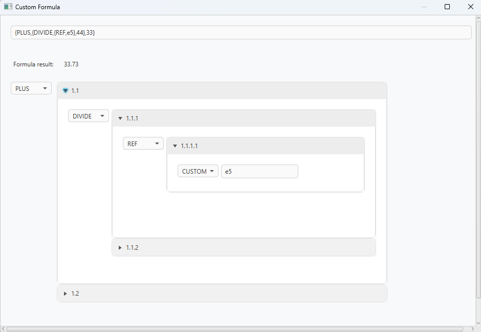

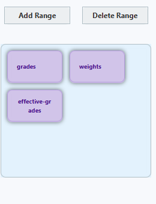"**Range
area":**

When the user selects a range, all cells within that range are
highlighted in blue.

**Add range:  
**

The user assigns a name to the range and then inputs the range in the
following format: \<top left cell ID\>..\<bottom right cell ID\>.

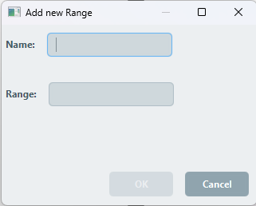

**Delete Range:  
**

After the user selects "Delete Range," they need to choose the range
they want to delete and then click on "Submit Delete" to confirm, or
"Cancel" to discard the action.

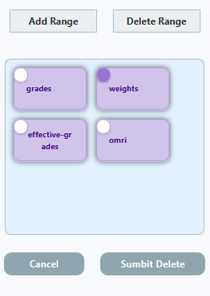
